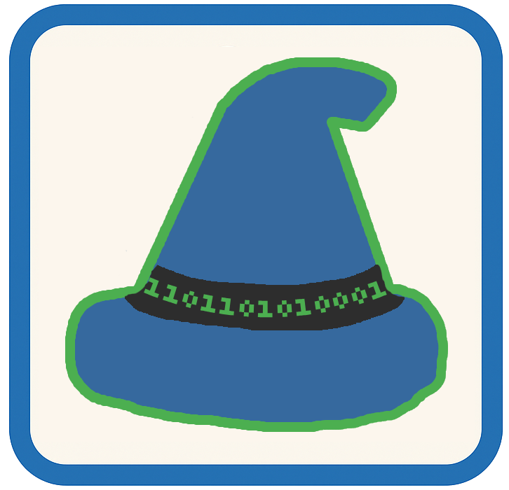
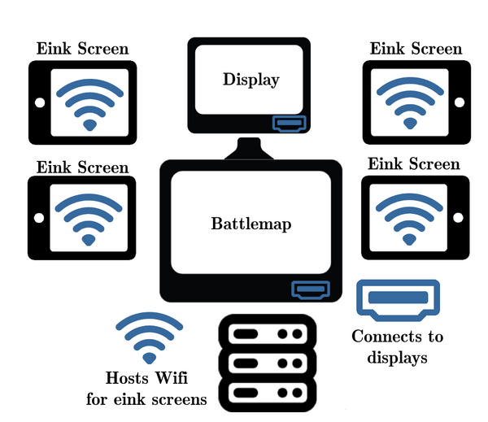

# Screen Sage



**A web-based control center for tabletop RPG management and multimedia display.**

ScreenSage provides powerful tools for Game Masters to manage combat, display media across multiple screens and control e-ink displays. This is a linux based project that can controlled locally or remotely via web browser.



[](https://opensource.org/licenses/MIT)
[](https://www.rust-lang.org/)
[](https://www.python.org/)

## Features

### ScryingGlass Display System
- **Multi-Display Support**: Control content across multiple monitors
- **Touch-Enabled**: Full touchscreen support for player interaction
- **Dynamic Layouts**: JSON-based configuration for complete customization
- **Fog of War**: Interactive fog system with wall shadows and clearing
- **Zoom & Pan**: Real-time zoom with smooth interpolation

### Management System
- **Combat Tracker** - Initiative tracking with overlay and display
- **Media Browser** - Browse and display images/videos to screens
- **Virtual Tabletop (VTT) Editor** - Full-featured battlemap interface
- **AI Image Generation** - Stability AI API integration
- **WiFi & Hotspot Management** - Dual-interface networking with internet sharing
- **SageSlate E-Ink Manager** - Player aids and character sheets. See [SageSlate](https://github.com/AndrewMorgan2/SageSlate)

[Full documentation](FEATURES.md)

## Quick Start

### Installation

```bash
# Clone repository
git clone git@github.com:AndrewMorgan2/ScreenSage.git
cd ScreenSage

# Install dependencies (Ubuntu/Debian)
sudo apt install cargo rustup pkg-config libssl-dev -y
rustup default stable

# Run
cargo run
```

Open browser: **http://localhost:8080**

**Full installation guide:** [Installation Wiki](../../wiki/Installation)

## Documentation

**📖 [Visit the Wiki for Complete Documentation](../../wiki)**

### Quick Links

**🚀 Getting Started:**
- [Installation Guide](../../wiki/Installation) - Complete system setup
- [Quick Start](../../wiki/Quick-Start) - Get running in 5 minutes
- [Configuration](../../wiki/Configuration) - Storage and settings

**✨ Features:**
- [ScryingGlass Display System](../../wiki/ScryingGlass-Display-System) - Multi-display rendering
- [VTT Editor](../../wiki/VTT-Editor) - Visual battlemap editor
- [Combat Tracker](../../wiki/Combat-Tracker) - Initiative management
- [AI Image Generation](../../wiki/AI-Image-Generation) - Stability AI integration
- [WiFi & Hotspot Management](../../wiki/WiFi-Hotspot-Management) - Network control
- [SageSlate E-Ink Manager](../../wiki/SageSlate-E-Ink-Manager) - E-ink displays

**🔧 Setup Guides:**
- [Touchscreen Setup](../../wiki/Touchscreen-Setup) - Configure touch input
- [WiFi Hotspot Setup](../../wiki/WiFi-Hotspot-Setup) - Portable network
- [Multi-Display Configuration](../../wiki/Multi-Display-Configuration) - Complex setups
- [Useful Commands](../../wiki/Useful-Commands) - Quick reference

**👨‍💻 Developer Documentation:**
- [Architecture Overview](../../wiki/Architecture-Overview) - System design
- [Backend Documentation](../../wiki/Backend-Documentation) - Rust implementation
- [Frontend Documentation](../../wiki/Frontend-Documentation) - JavaScript modules
- [ScryingGlass Documentation](../../wiki/ScryingGlass-Documentation) - Python display engine

## Architecture

### Technology Stack

**Backend:**
- Rust + Actix Web for high-performance HTTP server
- Python + Pyglet for display rendering
- JSON for configuration and data storage

**Frontend:**
- Vanilla JavaScript (no frameworks)
- Modular architecture with shared components
- Real-time preview system

**Hardware Integration:**
- Xinput for touchscreen mapping
- Xrandr for display configuration
- ESP32 for wireless e-ink displays

### Directory Structure

```
ScreenSage/
├── src/                    # Rust backend source
│   ├── templates/          # HTML templates
│   └── docs/              # Backend documentation
├── static/                 # Frontend assets
│   ├── js/vtt/            # VTT JavaScript modules
│   ├── css/               # Stylesheets
│   └── docs/              # Frontend documentation
├── ScryingGlass/          # Python display engine
│   └── docs/              # Display documentation
├── storage/               # Data storage
│   ├── scrying_glasses/   # Display configurations
│   ├── vtt_configs/       # VTT templates
│   ├── display_configs/   # Display tab templates
│   ├── templates/         # E-ink templates
│   ├── images/            # Image assets
│   └── generated_images/  # AI-generated images
└── Loader_esp32wf/        # ESP32 Arduino code
```

### Multi-Display Setup

Support for complex multi-screen configurations:

1. **DM Control Screen**: Web interface for managing content
2. **Player Battlemap**: Touch-enabled combat display
3. **E-Ink Displays**: Character sheets and handouts
4. **Secondary Displays**: Additional media screens

[Setup guide](TOUCHSCREEN_SETUP.md)

## Configuration

### Storage Layout

- **`scrying_glasses/`** - Active display configurations
- **`vtt_configs/`** - Battlemap templates for VTT tab
- **`display_configs/`** - Display templates for Display tab
- **`templates/`** - E-ink JSON templates
- **`images/`** - Image assets for the project
- **`ai_images/`** - AI-generated images
- **`generated_images/`** - E-ink processed images

### Environment Configuration

**ESP32 Default Credentials** (for e-ink displays):
- SSID: `player_handouts_andy`
- Password: `DnDepaper101`

Edit `ESP32_wifi_code/Loader_esp32wf.ino` to change.

**Network File Sharing:**
See [INSTALLATION.md](INSTALLATION.md) for NFS setup.

## License

This project is licensed under the MIT License - see the LICENSE file for details.

## Acknowledgments

**Technologies:**
- [Actix Web](https://actix.rs/) - Rust web framework
- [Pyglet](https://pyglet.readthedocs.io/) - Pyglet game library
- [Stability AI](https://stability.ai/) - AI image generation

## Roadmap

See [TODO.md](TODO.md) for detailed roadmap. Highlights:

- **Coming Soon:**
  - Visual wall fog editor

- **Future Plans:**
  - Unity/Tilt 5 integration
  - Enhanced combat features
---
