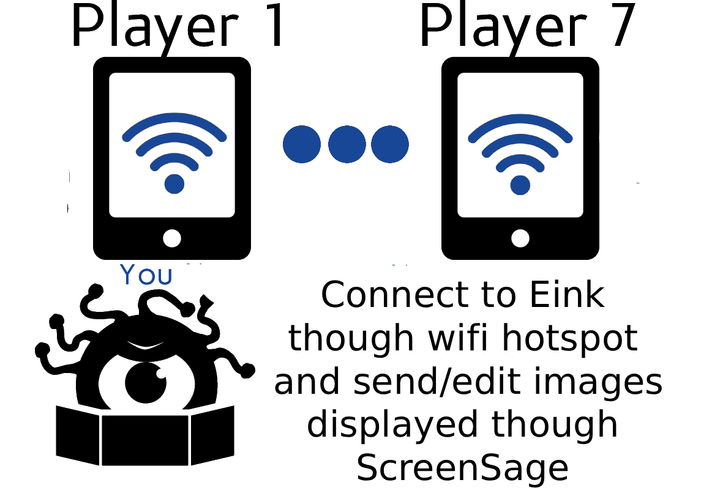
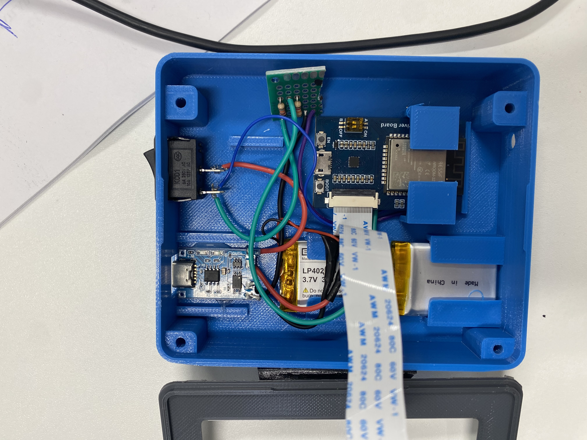

# SageSlate E-Ink Hardware Guide

SageSlate turns cheap e-ink panels and an ESP32 into wireless player handout screens for your TTRPG sessions. Each screen connects to your WiFi network and receives images pushed from the ScreenSage app over a TCP connection — no Bluetooth, no pairing, no fuss.



---

## Parts List (per screen)

| Part | Notes |
|------|-------|
| Waveshare 4.2" e-ink display + driver board | 400×300, black/white |
| ESP32 development board (e.g. ESP32-WROOM-32) | Any standard 38-pin board works |
| 3.7 V LiPo battery (LP402535 or similar) | Shown in build photo |
| TP4056 USB-C charging module | Optional — lets you charge without opening the case |
| Toggle switch | For power on/off |
| Jumper/dupont wires | For wiring ESP32 to driver board |
| 3D printed case | STL files provided (see below) |

---

## 3D Printing the Case

Four STL files are in `SageSlate/stls/`:

| File | Part |
|------|------|
| `case_4_2_v5.stl` | Main body |
| `case_4_2_v5_stand.stl` | Desk stand (print ×2) |
| `lid.stl` | Back cover |

Print in PLA or PETG. The body holds the e-ink panel face-down, the ESP32, and the battery. The two triangular stands clip on the sides so the screen can sit at an angle on a table.

---

## Wiring

Connect the Waveshare e-ink driver board to the ESP32 using the SPI pins defined in `SageSlate/ESP32_wifi_code/epd.h`:

| ESP32 GPIO | Driver board pin |
|-----------|-----------------|
| 13 | SCK (CLK) |
| 14 | DIN (MOSI) |
| 15 | CS |
| 25 | BUSY |
| 26 | RST |
| 27 | DC |
| 3.3 V | VCC |
| GND | GND |

The battery connects via the TP4056 module so it can be charged over USB-C. Wire a toggle switch in series on the positive line for a physical power switch.



---

## Flashing the ESP32

### 1. Install Arduino IDE

Download from [arduino.cc](https://www.arduino.cc/en/software). Install the **ESP32 board package**:

1. Open **File → Preferences**
2. Add to *Additional Boards Manager URLs*:
   ```
   https://raw.githubusercontent.com/espressif/arduino-esp32/gh-pages/package_esp32_index.json
   ```
3. Open **Tools → Board → Boards Manager**, search *esp32*, install **esp32 by Espressif Systems**.

### 2. Configure WiFi credentials

Open `SageSlate/ESP32_wifi_code/srvr.h` and update these three lines near the top:

```cpp
const char *ssid     = "your_wifi_name";
const char *password = "your_wifi_password";
const char* hostname = "einkScreen0";   // unique name per display
```

Give each screen a different hostname (`einkScreen0`, `einkScreen1`, etc.) so you can tell them apart on your network.

### 3. Set a static IP address

Still in `srvr.h`, set a static IP that doesn't conflict with other devices:

```cpp
IPAddress staticIP(192, 168, 1, 200);  // change to suit your network
IPAddress gateway(192, 168, 1, 1);
IPAddress subnet(255, 255, 255, 0);
IPAddress dns(8, 8, 8, 8);
```

Use a different last octet for each screen (e.g. `.200`, `.201`, `.202`).

### 4. Set the display type

In `SageSlate/ESP32_wifi_code/Loader_esp32wf.ino`, the display type is set in `setup()`:

```cpp
EPD_dispIndex = 44;  // 4.2 inch (400×300)
```

Supported indices:

| Index | Display | Resolution |
|-------|---------|-----------|
| 0 | 1.54 inch | 200×200 |
| 3 | 2.13 inch | 250×122 |
| 7 | 2.7 inch | 264×176 |
| 9 | 2.9 inch | 296×128 |
| **44** | **4.2 inch** | **400×300** |
| 19 | 7.5 inch | 800×480 |

### 5. Upload

1. Select **Tools → Board → ESP32 Dev Module**
2. Select the correct **Port**
3. Click **Upload**

Watch the Serial Monitor (115200 baud) — on boot you should see:

```
WiFi connected
IP address: 192.168.1.200
TCP server started
```

---

## Sending Images Over WiFi

With the ESP32 running, use the provided Python script to push any image to the screen.

### Install dependencies

```bash
pip install Pillow numpy
```

### Send an image

```bash
python SageSlate/ESP32_wifi_code/your_image.py <ip_address> <path_to_image>
```

**Example:**

```bash
python SageSlate/ESP32_wifi_code/your_image.py 192.168.1.200 ~/handouts/map.png
```

The script will:
1. Open and resize the image to the display's resolution (default 400×300 for 4.2")
2. Convert it to 1-bit black and white
3. Pack the pixels into bytes and send them over TCP port 8080
4. The ESP32 receives the data and refreshes the e-ink panel

**Optional flags:**

```bash
python your_image.py <ip> <image> --port 8080 --width 400 --height 300
```

| Flag | Default | Description |
|------|---------|-------------|
| `--port` | 8080 | TCP port |
| `--width` | 400 | Target image width in pixels |
| `--height` | 300 | Target image height in pixels |

Match `--width` and `--height` to your display's resolution (see table above).

---

## Finished Build


The completed screen sits on its printed triangle stands. E-ink holds the last image indefinitely with zero power draw — the battery only matters while the image is being updated.

---

## Troubleshooting

**Screen doesn't connect to WiFi**
- Double-check SSID/password in `srvr.h` and re-flash.
- Check that your router's 2.4 GHz band is enabled — ESP32 does not support 5 GHz.

**Python script errors "Connection refused"**
- Confirm the static IP in `srvr.h` matches the address you're sending to.
- Check the Serial Monitor to verify the ESP32 printed its IP on boot.

**Image looks wrong (inverted or garbled)**
- Make sure `--width` and `--height` match your actual display resolution.
- The 2.7" display (index 7) automatically inverts its bits — this is handled in firmware.

**Screen doesn't refresh**
- E-ink can take 2–3 seconds to fully refresh. Wait before assuming it failed.
- If using a 3-colour display, the red channel is sent as all-white by default — only black and white content will appear.

---

## Related

- [SageSlate GitHub repository](https://github.com/AndrewMorgan2/SageSlate)
- [ScreenSage Installation](INSTALLATION.md)
- [Features overview](FEATURES.md)
